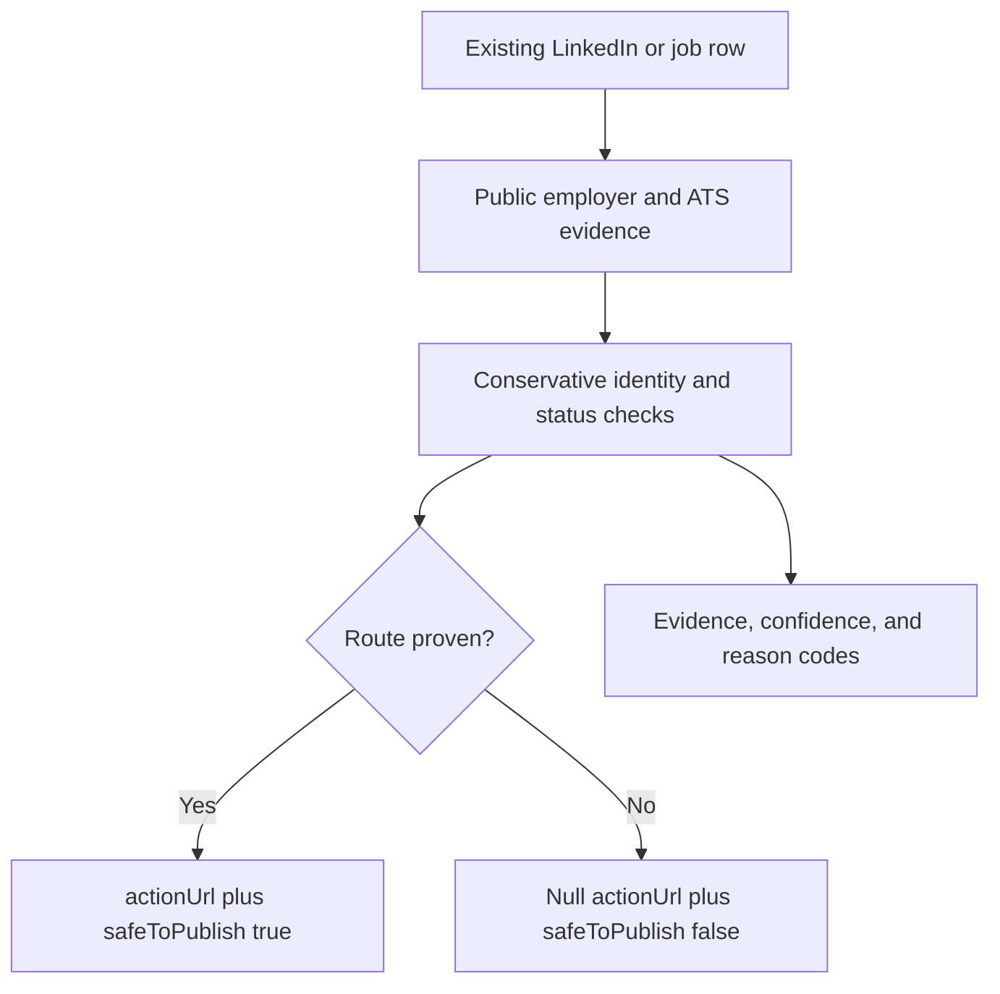

> **Live API with ongoing maintenance:** [Run LinkedIn Job Apply Link Verifier on Apify](https://apify.com/kamerozkan/linkedin-job-apply-link-verifier)

# LinkedIn Job Apply Link Verifier Samples

[](https://apify.com/kamerozkan/linkedin-job-apply-link-verifier)


Recover exact employer or ATS application URLs and block expired, mismatched,
or unproven job rows before they reach a job board or recruiting workflow.

This Actor verifies job rows you already have. It is not a LinkedIn scraper and
does not require LinkedIn cookies, credentials, or a browser profile.

## What it returns

| Input problem | Verified decision |
| --- | --- |
| Missing or broken application URL | Exact employer or ATS route when proven |
| Generic company careers page | Job-specific route when a conservative match succeeds |
| Official job no longer available | `EXPIRED`, `actionUrl: null`, `safeToPublish: false` |
| Evidence is insufficient | `AMBIGUOUS`, no publishable URL |
| LinkedIn Easy Apply job | `LINKEDIN_EASY_APPLY` with the LinkedIn route |

The release rule is simple: use `actionUrl` only when `safeToPublish` is
`true`.

## Measured public example

On 2026-07-28, the public `verify-linkedin-job-application-links` task produced
12 useful decisions from 12 rows. Eleven routes were publishable and one
expired row was blocked. This is a dated example run, not a guarantee for every
future source.

## Run an example

```bash
export APIFY_TOKEN="your_token_here"

curl --fail-with-body \
  --request POST \
  "https://api.apify.com/v2/acts/kamerozkan~linkedin-job-apply-link-verifier/run-sync-get-dataset-items" \
  --header "Authorization: Bearer ${APIFY_TOKEN}" \
  --header "Content-Type: application/json" \
  --data @01_verify_job_application_links_input.json
```

Never commit an API token.

## Three runnable inputs

<details>
<summary><strong>1. Verify LinkedIn job application links</strong></summary>

```json
{
  "autoDiscoverCompanyWebsite": true,
  "useReaderFallback": true,
  "maxItems": 2,
  "rows": [
    {
      "jobId": "4440290852",
      "jobUrl": "https://www.linkedin.com/jobs/view/4440290852",
      "jobTitle": "Staff Production Engineer",
      "companyName": "GitHub",
      "companyUrl": "https://www.linkedin.com/company/github",
      "location": "United States"
    },
    {
      "jobId": "4397632571",
      "jobUrl": "https://www.linkedin.com/jobs/view/4397632571",
      "jobTitle": "Principal Software Engineer",
      "companyName": "GitHub",
      "companyUrl": "https://www.linkedin.com/company/github",
      "location": "United States"
    }
  ]
}
```

</details>

<details>
<summary><strong>2. Find official career page links</strong></summary>

```json
{
  "autoDiscoverCompanyWebsite": true,
  "useReaderFallback": true,
  "maxSearchQueries": 3,
  "maxCandidates": 6,
  "maxBridgePages": 3,
  "maxItems": 2,
  "rows": [
    {
      "jobId": "4431451933",
      "jobUrl": "https://www.linkedin.com/jobs/view/4431451933",
      "jobTitle": "Staff Product Manager",
      "companyName": "GitHub",
      "companyUrl": "https://www.linkedin.com/company/github",
      "location": "Ontario, Canada"
    },
    {
      "jobId": "4429363475",
      "jobUrl": "https://www.linkedin.com/jobs/view/4429363475",
      "jobTitle": "Senior Software Engineer",
      "companyName": "GitHub",
      "companyUrl": "https://www.linkedin.com/company/github",
      "location": "United Kingdom"
    }
  ]
}
```

</details>

<details>
<summary><strong>3. Validate rows before publishing</strong></summary>

```json
{
  "autoDiscoverCompanyWebsite": true,
  "useReaderFallback": true,
  "maxSearchQueries": 3,
  "maxCandidates": 6,
  "maxBridgePages": 3,
  "maxItems": 2,
  "rows": [
    {
      "jobId": "4432033614",
      "jobUrl": "https://www.linkedin.com/jobs/view/4432033614",
      "jobTitle": "Staff Software Engineer, Electron & Browser Infrastructure - Slack Desktop",
      "companyName": "Slack",
      "companyUrl": "https://www.linkedin.com/company/tiny-spec-inc",
      "location": "California, United States"
    },
    {
      "jobId": "4445263278",
      "jobUrl": "https://www.linkedin.com/jobs/view/4445263278",
      "jobTitle": "Sr. Security Software Engineer, Vulnerability Management - Slack",
      "companyName": "Slack",
      "companyUrl": "https://www.linkedin.com/company/tiny-spec-inc",
      "location": "San Francisco, CA"
    }
  ]
}
```

</details>

The same inputs are available as standalone JSON files in this repository.

## Three real output examples

These records are sanitized excerpts from successful Apify runs on 2026-07-28.
Job availability can change after the recorded `checkedAt` time.

<details>
<summary><strong>ACTIVE: exact employer route verified</strong></summary>

```json
{
  "status": "ACTIVE",
  "actionUrl": "https://www.github.careers/careers-home/jobs/5544",
  "safeToPublish": true,
  "reviewRequired": false,
  "confidence": 1,
  "sourceProvider": "employer_site",
  "evidence": [
    "company_branded_job_domain",
    "jobposting_jsonld",
    "strict_title_and_company_match"
  ]
}
```

[Open the full record](01_active_employer_route_output.json)

</details>

<details>
<summary><strong>ACTIVE: exact ATS route verified</strong></summary>

```json
{
  "status": "ACTIVE",
  "actionUrl": "https://salesforce.wd12.myworkdayjobs.com/Slack/job/Georgia---Atlanta/Staff-Software-Engineer--Electron---Browser-Infrastructure---Slack-Desktop_JR345720",
  "safeToPublish": true,
  "reviewRequired": false,
  "confidence": 0.97,
  "sourceProvider": "workday"
}
```

[Open the full record](02_active_ats_route_output.json)

</details>

<details>
<summary><strong>EXPIRED: unsafe route blocked</strong></summary>

```json
{
  "status": "EXPIRED",
  "actionUrl": null,
  "safeToPublish": false,
  "reviewRequired": false,
  "confidence": 0.95,
  "sourceProvider": "workday"
}
```

[Open the full record](03_expired_blocked_output.json)

</details>

## Decision pipeline



## Data contract

The machine-readable contract is in
[`dataset_record.schema.json`](dataset_record.schema.json). Important fields:

- `status`: final verification decision
- `actionUrl`: route a downstream product may open
- `safeToPublish`: machine-readable release gate
- `reviewRequired`: whether the row needs manual review
- `confidence`: match strength
- `sourceProvider`: verified source type
- `evidence`: checks supporting the decision
- `original`: unchanged source row

## Limits

- The Actor checks public evidence. Source sites can throttle, remove, or
  change pages.
- A live official route proves that an application path exists. It cannot prove
  a hiring manager's private intent or guarantee that a role will be filled.
- Job URLs and statuses in this repository are time-stamped examples, not a
  current employment listing service.

## Links

- [Run the live Actor](https://apify.com/kamerozkan/linkedin-job-apply-link-verifier)
- [Open the Actor API page](https://apify.com/kamerozkan/linkedin-job-apply-link-verifier/api)
- [Kamer Ozkan on Apify](https://apify.com/kamerozkan)

## Responsible use

Review the source terms and laws that apply to your workflow. See
[`DATA_NOTICE.md`](DATA_NOTICE.md).

## License

Original documentation and schemas in this repository are available under the
[MIT License](LICENSE). Third-party job data is outside that license.
